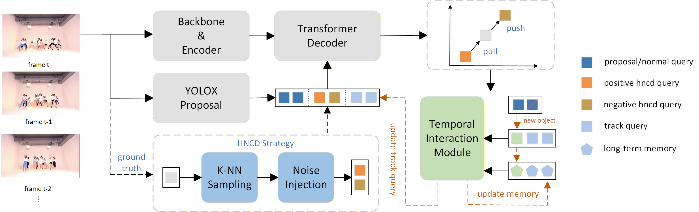

# HNCD



**HNCD-MOTR** is a robust end-to-end multi-object tracker empowered by contrastive learning. We introduce a novel Hard Negative Contrastive Denoising (HNCD) training paradigm to enforce discriminative feature learning, thus effectively mitigating identity confusion in crowded scenes. Furthermore, we demonstrate that its learned representations can be efficiently reused as a high-quality feature basis for traffic anomaly detection, significantly accelerating convergence and improving detection accuracy.

## Architecture variants

The codebase supports three end-to-end MOT architectures via two CLI flags (`--arch` and `--use-proposals`). All three share the same DAB-Deformable-DETR backbone and the same HNCD training strategy; they differ only in (a) whether MOTRv2-style proposals are injected and (b) which track-update module / first-decoder-layer regime is used.

| Variant | `--arch` | `--use-proposals` | Track update | First-decoder-layer | Notes |
|---|---|---|---|---|---|
| **MeMOTR + HNCD** | `memotr` | (omit) | TIM (long-term memory) | merge_det_track at layer 0 | HNCD applied to the original MeMOTR base. 300 detection queries, no detector proposals. |
| **HNCD-MOTR (Hybrid + HNCD)** | `memotr` | (set) | TIM | merge_det_track at layer 0 | The main paper result. MeMOTR base augmented with MOTRv2-style detector proposals. 10 base queries + N proposals. |
| **MOTRv2 + HNCD** | `motrv2` | (set) | QIMv2 (self-attention only) | no merge trick | Ablation that drops the MeMOTR-specific TIM / first-layer merge in favour of MOTRv2's QIMv2 design. 10 base queries + N proposals. |

Note: presence of `--use-proposals` enables proposals; omitting the flag disables them. The associated config file (`--config-path`) sets the matching `NUM_DET_QUERIES`, `MERGE_DET_TRACK_LAYER`, `APPEND_CROWD`, etc., so commands further below pair them consistently.

## Installation

```shell
conda create -n HNCD python=3.10  # create a virtual env
conda activate HNCD               # activate the env
conda install pytorch==1.13.1 torchvision==0.14.1 torchaudio==0.13.1 pytorch-cuda=11.7 -c pytorch -c nvidia
conda install matplotlib pyyaml scipy tqdm tensorboard
pip install opencv-python
```

You also need to compile the Deformable Attention CUDA ops:

```shell
# From https://github.com/fundamentalvision/Deformable-DETR
cd ./models/ops/
sh make.sh
# You can test this ops if you need:
python test.py
```

## Data

You should put the unzipped CrowdHuman datasets into the `DATADIR/CrowdHuman/images/`. And then generate the ground truth files by running the corresponding script: [./data/gen_crowdhuman_gts.py](./data/gen_crowdhuman_gts.py).

For the MOTRv2-style proposals path (Hybrid+HNCD and MOTRv2+HNCD), you also need the YOLOX detector outputs cached as `det_db.json` (path is set via the `DET_DB` field in the YAML configs).

Finally, you should get the following dataset structure:
```
DATADIR/
  ├── DanceTrack/
  │ ├── train/
  │ ├── val/
  │ ├── test/
  │ ├── train_seqmap.txt
  │ ├── val_seqmap.txt
  │ └── test_seqmap.txt
  ├── SportsMOT/
  │ ├── train/
  │ ├── test/
  │ ├── train_seqmap.txt
  │ ├── val_seqmap.txt
  │ └── test_seqmap.txt
  ├── CrowdHuman/
  │ ├── images/
  │ │ ├── train/     # unzip from CrowdHuman
  │ │ └── val/       # unzip from CrowdHuman
  │ └── gts/
  │   ├── train/     # generate by ./data/gen_crowdhuman_gts.py
  │   └── val/       # generate by ./data/gen_crowdhuman_gts.py
  └── det_db.json    # YOLOX detector outputs (only needed for proposals-on variants)
```


## Pretrain

We initialize our model with the official DAB-Deformable-DETR (with R50 backbone) weights pretrained on the COCO dataset, you can also download the checkpoint we used [here](https://drive.google.com/file/d/17FxIGgIZJih8LWkGdlIOe9ZpVZ9IRxSj/view?usp=sharing). And then put the checkpoint at the root of this project dir.

> The same DAB-Deformable-DETR pretrained weight is used for all three variants. MOTRv2 itself also adopts DAB-style 4D anchor queries (see the MOTRv2 paper, Sec. 3.1: "We first adopt the anchor formulation of queries"), so reusing the DAB pretrain for the MOTRv2+HNCD variant is consistent with their design.

## Scripts on DanceTrack

All commands below assume 4 GPUs and use gradient checkpointing (`--use-checkpoint`) to fit on ≤24 GB cards. Drop `--use-checkpoint` if you have plenty of memory.

```

### Training: HNCD-MOTR

DanceTrack + CrowdHuman, MOTRv2 proposals enabled, TIM track update. This is the configuration that produced the headline 71.8 HOTA on the DanceTrack test set.

```shell
python -m torch.distributed.run --nproc_per_node=4 main.py \
    --use-distributed --config-path ./configs/train_dancetrack.yaml \
    --outputs-dir ./outputs/hncd_motr/ --use-checkpoint \
    --arch memotr --use-proposals \
    --data-root <your data dir path>
```

### Submit and Evaluation

The eval script auto-spawns a distributed submit subprocess. Pass the same `--arch` / `--use-proposals` you trained with:

```shell

# HNCD-MOTR
python main.py --mode eval --eval-mode specific \
    --eval-model checkpoint_19.pth --eval-dir ./outputs/hncd_motr/ \
    --eval-threads 4 --config-path ./configs/train_dancetrack.yaml \
    --arch memotr --use-proposals \
    --data-root <your data dir path>
```

## Scripts on SportsMOT and other datasets

You can replace the `--config-path` in the [DanceTrack scripts](#scripts-on-dancetrack) with the corresponding `./configs/train_<dataset>.yaml`. The `--arch` / `--use-proposals` semantics are the same across datasets.


## Results

### Multi-Object Tracking on the DanceTrack test set

| Methods                  | HOTA | DetA | AssA | checkpoint                                                   |
| ------------------------ | ---- | ---- | ---- | ------------------------------------------------------------ |
| HNCD (HNCD-MOTR, main)   | 71.8 | 83.5 | 61.9 | [Google Drive](https://drive.google.com/file/d/13XjwQwKs6juhuXntZWM0LU6quawh7VIp/view?usp=drive_link) |

### Multi-Object Tracking on the SportsMOT test set

| Methods                  | HOTA | DetA | AssA | checkpoint                                                   |
| ------------------------ | ---- | ---- | ---- | ------------------------------------------------------------ |
| HNCD                     | 71.7 | 84.2 | 61.2 | [Google Drive](https://drive.google.com/file/d/1H58SpBb_DcjvAvEPTo5BXnAki89UUxMG/view?usp=drive_link) |

